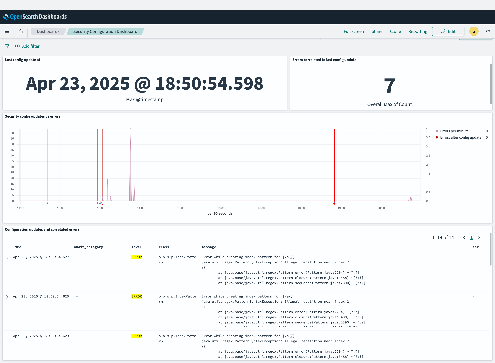

# OpenSearch Dashboards Visualizations and Applications

This directory contains visualizations and other applications of the ingested log data.

## Visualizations

### Privileges Dashboard


The privileges dashboard shows information about the privilege errors in a given time frame.

Privilege errors can be:

- Missing privileges
- Errors while evaluating index patterns
- Errors while evaluating DLS queries

Missing privileges can be the consequence of errors while evaluating index patterns.

The dashboard is divided into two colums:

- The left column refers to index privileges
- The right column refers to cluster privileges


#### Technical background

While most data in the dashboard is retrieved from the standard `opensearch-logs` index, the
missing index privilege information is retrieved from the `opensearch-missing-index-privileges-logs` index. 

This index contains a representation of the missing privilege matrix in exploded form:

```
                                           | indices:admin/aliases/get |
otel-v1-apm-service-map-sample             | MISSING                   |
otel-v1-apm-span-sample                    | MISSING                   |
.ql-datasources                            | MISSING                   |
test_a2                                    | MISSING                   |
test_a1                                    | MISSING                   |
```

For missing privilege events with a single referenced index, also a single document is created in this index. This document specifies
the action with missing privileges in the `action` field. All indices with missing privileges are contained
as error in the `index` field.

Any index which is reported to have `ok` privileges is not represented in this data structure.

If the matrix references two different actions, also two documents will be created in the  `opensearch-missing-index-privileges-logs` index.

This document structure is realized by Fluentbit which uses a custom Lua script to parse the matrix.


#### Rooms for improvement

- When assigning privileges to role, one should prefer to use action groups instead of raw actions. However, the dashboard only shows raw actions.

### Security Configuration Dashboard



The purpose of the security configuration dashboard is to show errors caused by updates to the security configuration.

It shows:

- The general error log rate
- As blue markers the points in time the security configuration was updated
- As red markers the points in time where there were errors which were time wise correlated to the configuration update (i.e., which occurred in the next 5 seconds).
- Error logs that occurred in the 5 seconds after configuration updates

Note: It is not guaranteed that the errors are actual consequences of configuration updates. We only take the timewise proximity as indicator for a possible relatedness.


#### Technical background

The time-based correlation is materialized by a custom data prepper plugin. See [data-prepper-config-error-agg-plugin](../data-prepper-config-error-agg-plugin). 

In the index the correlation looks like this:

```json
{
  "_index": "opensearch-logs",
  "_id": "YAWPY5YBSrQrI7Zn7zfD",
  "_version": 1,
  "_score": null,
  "_source": {
    "@timestamp": "2025-04-23T16:50:54.627000Z",
    "level": "ERROR",
    "class": "o.o.s.p.IndexPattern     ",
    "node": "main-cluster-master-1",
    "message": "...",
    "log": "...",
    "stream": "stdout",
    "time": "2025-04-23T16:50:54.629231253Z",
    "log_type": "std",
    "config_change_start_timestamp": "2025-04-23T16:50:54.598000Z",
    "config_change_group_ref": "7ed47e7e-3ef5-442f-82ca-af5fd2c45f0c"
  }
}
```

The presence of the attributes `config_change_start_timestamp` and `config_change_group_ref` indicates the correlation. `config_change_start_timestamp` indicates the time the config change took place.
The attribute `config_change_group_ref` is a kind of foreign key that refers to the `config_change_group_head` attribute (also generated by the Data Prepper plugin) in the audit log event indicating the config change.


#### Rooms for improvement

- The number "Errors correlated to last config update" is actually not correct. It is all correlated error logs in the selected time window.
- In order to feed the audit logs to Data Prepper, these have to be written by log4j to log files and then read by Fluentbit and forwarded to Data Prepper.
